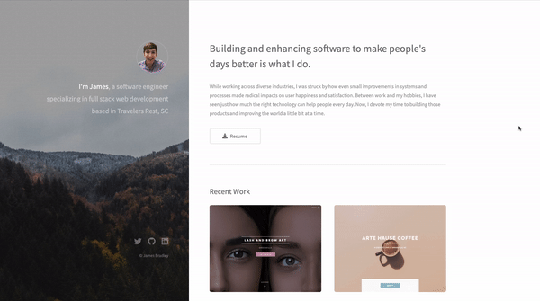

<h1 align="center">Hi 👋, I'm James, welcome to my GitHub.</h1>

  
  
  
  

I'm a software engineer based in Greenville, SC. My specialty is building full-stack JavaScript applications.
See [my website](https://jamesbradley.netlify.app/) for more information!

<h1 align="center">Projects</h1>
<table bordercolor="#66b2b2">
  
  <tr>
    <td width="50%" valign="top">
      <h3 align="center">Portfolio</h3>
         
        
         
        

          
    
  
      

        
<strong>HTML5, CSS3, JavaScript</strong> - Personal site that includes links to my projects and ways to get in contact with me.

    </td>
  </tr>
  
</table>

<h1 align="center">Technologies</h1>

    
    
    
    
    
    
    
    

---

<h1 align="center">Connect</h1>

    
    
    
    
  

</body>
</html>
